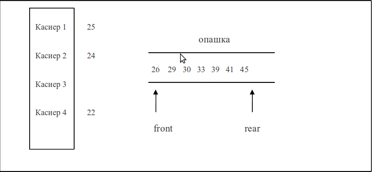

#Симулация на опашка в банка

Целта на тази симулация е да изгради представа в управителя на банка за ефективността на обслужването на случайно пристигащи в банката клиенти от определен брой касиери, както и за броя и времето за обслужване на клиенти от всеки касиер.

Когато клиент пристига в банката и всички касиери са заети с обслужване на други клиенти, новият клиент се нарежда на опашка. Когато лице се нареди на опашката, то получава уникален номер. На фиг. 1 е показана графично опашка в банка със 7 клиента и 4 касиера.

#### 

Всяка каса може да има 2 състояния отворена и затворена , като клиенти се обслужват само от отворени каси . Когато затворена каса се отвори тя поема първият клиент от опашката .

Да се напише програма, която симулира обслужването на опашка от клиенти в банка.

####Програмата да направи и изведе някои статистики за процеса на симулация, като:

* общ брой на обслужените клиенти;

* брой на обслужените клиенти от всеки касиер;

* средна сума минала през всяка една каса;

* средна дължина на опашката;

* максимална дължина на опашката;
