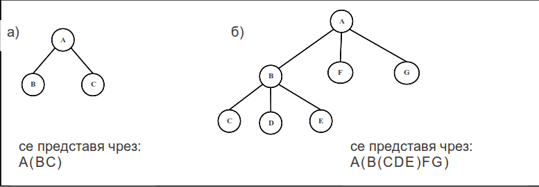

#Представяне на дърво чрез скоби

Структурата от данни ″дърво″ може да се представи чрез скоби по следния начин. След името на върха, оградени в скоби, се записват имената на всички негови наследници. Това описание се прилага рекурсивно към всеки от върховете на дървото. Например

#### 

Да се напише програма, която въвежда от текстов файл „дървета”, представени чрез скоби. Всяко дърво е записано на отделна линия във файла.

####Програмата да извежда на екрана всяко дърво като го обхожда по следния начин:

* възходящо обхождане (1-во, 2-ро, ..., n-то поддърво, корен);

* низходящо обхождане (корен, 1-во, 2-ро, ..., n-то поддърво).
